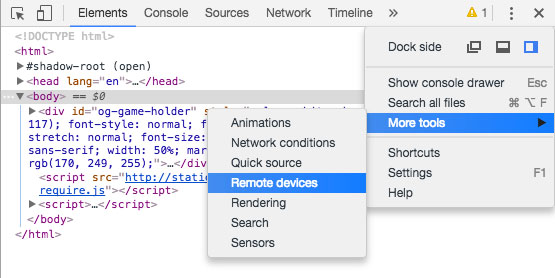
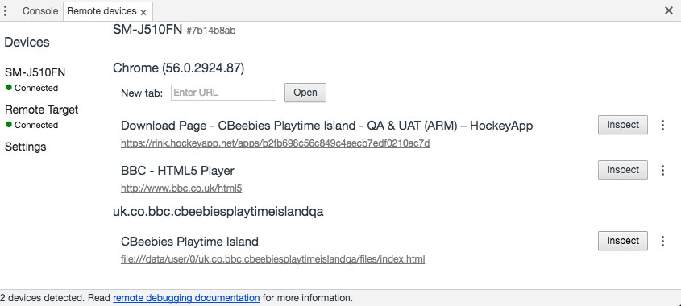
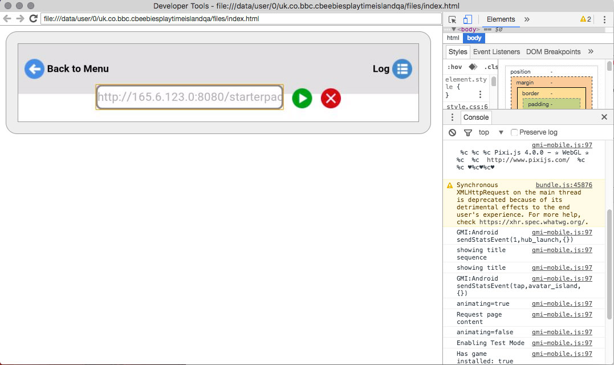

# Testing in a mobile app

To test your game in a mobile app you will need to to do the following:

1. Host your .gdz file

   If you have enabled [automated builds](build-pipeline.md#building-for-apps)
   of your .gdz file, your .gdz should be hosted on our servers. You should find
   the location [here](../README.md#important-links).

   Alternatively you can package the .gdz manually and host it yourself for local debugging.
   You will first need to build (and ideally minify) the game using the same process
   as in your build.sh file. Then run the following command to create a .gdz:

   ````
   zip -r starterpack.gdz -Z store . --exclude=*.sh* --exclude=*.svn* --exclude=*.git* --exclude=*.DS_Store*
   ````

   There are two ways to quickly start a local server:

   On OSX, a server can be started from any local folder by navigating to it and running:

   ````
   python -m SimpleHTTPServer 8000
   ````

   Alternatively, the [http-server](https://www.npmjs.com/package/http-server) npm package can be used.


2. Download the relevant app in Test Mode here (You will need to request access via
   your BBC technical project manager):

   * [Hockeyapp](https://rink.hockeyapp.net/manage/dashboard)

3. Run the app and click on the 'Add Game' button; enter the url for your .gdz file
and click download. Once it has finished downloading you can press play to test the .gdz.

To enable debugging (primarily for Apple devices): `window.gameSettings.debugEnabled`
should be set to true in the game code. When this setting is enabled, it should pass on
any `console.log()` messages generated in the game code to the native app. To view them,
go to the app, and there should be a button visible in the top right, which should give
you the option of viewing and emailing the logs.


## Debugging for Android

To see debugging tools for the app, ensure the phone and host machine are connected
to the same wi-fi network. Plug the phone into the host machine.

Go to Chrome, and bring up the developer tools (View > Developer > Developer Tools).
Click the three small dots at the top right of the tools window and go to More Tools >
Remote Devices.





Ensure the app is running, then select your device under 'Devices' in the Chrome
'Remote Devices' panel, select the app (in this case 'Cbeebies Playtime Island')
and click the 'Inspect' button. Accept any security pop-ups that appear on the device.





This will bring up Developer Tools for the app. You can now type in the location of the
.gdz into the app for debugging. Any errors will appear in the 'Console' window of
the developer tools.




If you are having issues loading the .gdz into the app, ensure that your device
is on the same network as the host machine, and try accessing the .gdz from the
device's browser to check that it's available.

More information on [Remote Debugging Android Devices](https://developers.google.com/web/tools/chrome-devtools/remote-debugging/).


## Common Issues

1. *Testing/Debugging in iOS*
Unfortunately there is no way to debug problems within the iOS app due to
restrictions/limitations in the Apple development ecosystem. By debugging on
Android in conjunction with testing on the Web, we will catch most of the problems
that would also affect iOS.

2. *Status Codes in Android*
XMLHttpRequests on Android don't return appropriate status codes i.e. 200. As a
result we recommend you check for status 200 or 0 and treat 0 as a success code.

3. *Audio*
Many Android devices have issues playing mp3 audio in the app. One way around
this is to provide ogg as the primary audio format with mp3 as the fallback.
On iOS devices ogg will be ignored and mp3s will play, on android ogg will
play sidestepping the mp3 problems.


[Home](../README.md)
